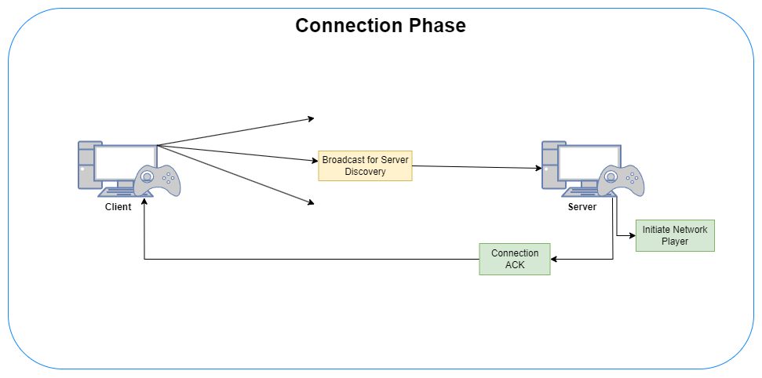
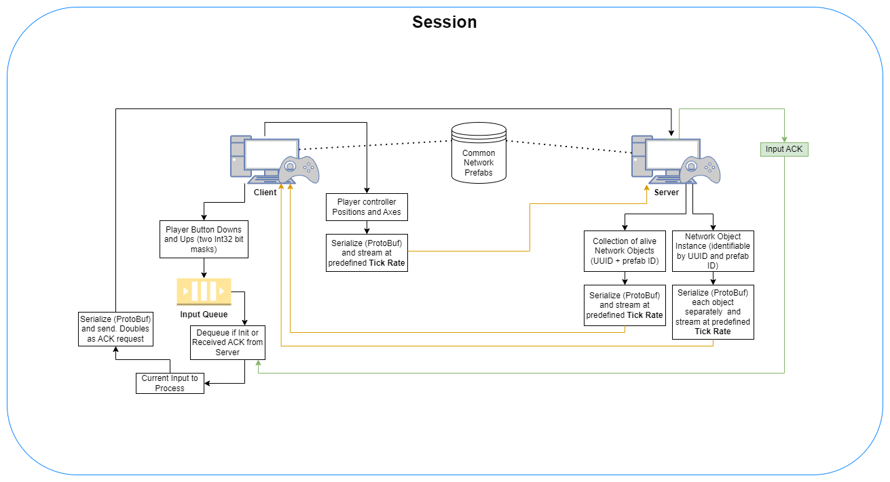

# Lightweight Network Demo

## Purpose: 
To implement a lightweight multiplayer networking solution to eliminate latency at all costs. This is necessary for smooth, real-time playability in extended reality within local network.

## General structure: 
Client-Server architecture written on top of UDP only communication.

## Features and Specs:
* No server or client RPC’s. Server streams each network object’s state as serialized representation, likewise for player controller positions and joystick axes. For serialization, this project uses ProtoBuf.
* Network object transforms (from server) and controller positions and axes (from client) are streamed without acknowledgements. On both the client and server side, only the most recent packet in the receive queue is accepted. The net result is the ability for clients to see the impact of their physical actions at the speed of client-server ping. With a good router that may even average around 5 to 10 ms wireless! Overall, it seems to cause less stutters and lower latency than does a similar implementation without movement interpolation with Unity Netcode.
>Reference - https://docs-multiplayer.unity3d.com/netcode/current/components/networktransform/#:~:text=Graphic%20of%20a%20buffered%20tick%20between%20the%20server%20and%20a%20client%20(that%20is%2C%20interpolation)

* Input from client requires server acknowledgement to prevent unexpected input related behaviors. Performance wise, there is almost no issue as inputs are invoked immediately, just like server RPC in Netcode. There might be concerns about input latency when it comes to quick successive player inputs, but current tests do not indicate input latency issues.
* At 120 tick-rate, you can expect about outgoing 0.04 Mbps per transform (no scale) per client. Lightweight Network does not yet implement position or rotational threshold, so bandwidth can still be optimized.

## Design Diagrams:

  
   
  

## Result:

  

> Unfortunately, the Foosball demo is not included in this project as it uses licensed 3D model.
> https://youtu.be/yeNRIM0vIiE

## Testing considerations:
* If you are running network tests with Unity Editor on Windows, make sure to allow Unity Editor through firewall. The editor tends not to play nicely with Windows Firewall.

* As much as I want to believe that WiFi 6 would be a game changer for multiplayer modes, its performance seems unstable on Quest 3. For now, I would suggest using WiFi 5 for reliability.
